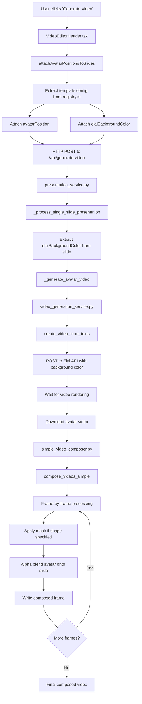
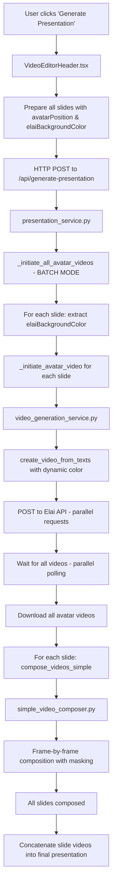

# Video Generation Pipeline Documentation

## Table of Contents
1. [Overview](#overview)
2. [Architecture](#architecture)
3. [Frontend Configuration](#frontend-configuration)
4. [Avatar Positioning System](#avatar-positioning-system)
5. [Elai API Integration](#elai-api-integration)
6. [Video Composition Pipeline](#video-composition-pipeline)
7. [Masking Techniques](#masking-techniques)
8. [Complete Pipeline Flow](#complete-pipeline-flow)
9. [Troubleshooting](#troubleshooting)

---

## Overview

The ContentBuilder.ai video generation system creates professional presentation videos by combining:
- **Static slide templates** (HTML/CSS rendered to images)
- **Dynamic avatar videos** (generated via Elai API)
- **Video composition** (OpenCV-based overlaying)

The system supports multiple avatar shapes (rectangular, circular, arch) and per-slide dynamic background colors for Elai video generation.

---

## Architecture

### High-Level Components

```
┌─────────────────────────────────────────────────────────────────┐
│                         FRONTEND                                 │
│  ┌────────────────────────────────────────────────────────┐    │
│  │ registry.ts - Slide Template Registry                   │    │
│  │  - Template configurations                              │    │
│  │  - avatarPosition (x, y, width, height, shape)         │    │
│  │  - elaiBackgroundColor                                  │    │
│  └────────────────────────────────────────────────────────┘    │
│                             │                                    │
│                             ▼                                    │
│  ┌────────────────────────────────────────────────────────┐    │
│  │ VideoEditorHeader.tsx                                   │    │
│  │  - Extracts slide data                                  │    │
│  │  - Attaches avatarPosition from registry               │    │
│  │  - Attaches elaiBackgroundColor from registry          │    │
│  │  - Sends payload to backend API                        │    │
│  └────────────────────────────────────────────────────────┘    │
└─────────────────────────────────────────────────────────────────┘
                             │
                             ▼ HTTP POST /api/generate-video
┌─────────────────────────────────────────────────────────────────┐
│                         BACKEND                                  │
│  ┌────────────────────────────────────────────────────────┐    │
│  │ presentation_service.py                                 │    │
│  │  - Orchestrates video generation                       │    │
│  │  - Batches avatar video requests                       │    │
│  │  - Extracts elaiBackgroundColor from slides            │    │
│  │  - Passes color to video_generation_service            │    │
│  └────────────────────────────────────────────────────────┘    │
│                             │                                    │
│                             ▼                                    │
│  ┌────────────────────────────────────────────────────────┐    │
│  │ video_generation_service.py                             │    │
│  │  - Communicates with Elai API                          │    │
│  │  - Uses elaiBackgroundColor for canvas.background     │    │
│  │  - Waits for video rendering completion                │    │
│  │  - Downloads avatar videos                             │    │
│  └────────────────────────────────────────────────────────┘    │
│                             │                                    │
│                             ▼                                    │
│  ┌────────────────────────────────────────────────────────┐    │
│  │ simple_video_composer.py                                │    │
│  │  - Overlays avatar videos onto slide videos            │    │
│  │  - Applies masking (circle, arch, rectangular)         │    │
│  │  - Uses OpenCV for alpha compositing                   │    │
│  │  - Transparent backgrounds (no fill)                   │    │
│  └────────────────────────────────────────────────────────┘    │
└─────────────────────────────────────────────────────────────────┘
                             │
                             ▼
                    Final Composed Video
```

---

## Frontend Configuration

### 1. Template Registry (`registry.ts`)

The `registry.ts` file is the **central configuration hub** for all slide templates. It defines:

#### Structure:
```typescript
export const SLIDE_TEMPLATE_REGISTRY: Record<string, TemplateComponentInfo> = {
  'template-id': {
    id: 'template-id',
    name: 'Template Name',
    description: 'Template description',
    category: 'content',
    icon: '📊',
    component: TemplateComponent,
    defaultProps: { /* ... */ },
    propSchema: { /* ... */ },
    
    // ✅ Avatar positioning configuration
    avatarPosition: {
      x: 1552,           // Absolute X coordinate (px) from top-left
      y: 64,             // Absolute Y coordinate (px) from top-left
      width: 272,        // Avatar area width (px)
      height: 272,       // Avatar area height (px)
      shape: 'circle',   // Masking shape: 'circle', 'arch', or undefined (rectangular)
      // ❌ backgroundColor removed - now transparent
    },
    
    // ✅ Elai API canvas background color
    elaiBackgroundColor: '#ffffff'  // Hex color for Elai video canvas
  }
}
```

#### Key Properties:

| Property | Type | Description | Required |
|----------|------|-------------|----------|
| `x` | `number` | Absolute X coordinate (pixels from left edge) | ✅ |
| `y` | `number` | Absolute Y coordinate (pixels from top edge) | ✅ |
| `width` | `number` | Avatar container width in pixels | ✅ |
| `height` | `number` | Avatar container height in pixels | ✅ |
| `shape` | `'circle' \| 'arch' \| undefined` | Avatar mask shape | ❌ |
| `elaiBackgroundColor` | `string` | Elai canvas background (hex) | ❌ |

### 2. Data Flow: Frontend to Backend

**Step 1:** User prepares video generation
```typescript
// VideoEditorHeader.tsx
const attachAvatarPositionsToSlides = (slides: any[]) => {
  return slides.map(slide => {
    const templateId = slide.templateId;
    const template = SLIDE_TEMPLATE_REGISTRY[templateId];
    const updatedSlide: any = { ...slide };
    
    // Attach avatarPosition from registry
    if (template?.avatarPosition) {
      updatedSlide.avatarPosition = template.avatarPosition;
    }
    
    // Attach elaiBackgroundColor from registry
    if (template?.elaiBackgroundColor) {
      updatedSlide.elaiBackgroundColor = template.elaiBackgroundColor;
    }
    
    return updatedSlide;
  });
};
```

**Step 2:** Payload sent to backend
```json
{
  "slides": [
    {
      "templateId": "course-overview-slide",
      "voiceover_text": "Welcome to this course...",
      "avatarPosition": {
        "x": 864,
        "y": 0,
        "width": 1056,
        "height": 1080
      },
      "elaiBackgroundColor": "#ffffff"
    }
  ],
  "avatar_code": "angela",
  "voice_id": "en-US-Standard-A"
}
```

---

## Avatar Positioning System

### Coordinate System

The slide canvas is **1920×1080 pixels** (Full HD). All coordinates are **absolute** positions from the top-left corner (0,0).

```
(0,0) ────────────────────────────────── (1920,0)
  │                                          │
  │    ┌──────────────────┐                │
  │    │  Avatar Area     │                │
  │    │  (x, y)          │                │
  │    │  width × height  │                │
  │    └──────────────────┘                │
  │                                          │
(0,1080) ─────────────────────────────── (1920,1080)
```

### Positioning Examples

#### 1. **Full Right Panel** (Rectangular Avatar)
```typescript
avatarPosition: {
  x: 864,       // Right panel starts at 864px
  y: 0,         // Top of slide
  width: 1056,  // 1920 - 864 = 1056px
  height: 1080  // Full height
}
```

#### 2. **Top-Right Circle**
```typescript
avatarPosition: {
  x: 1620,      // Calculated: 1920 - 60 (right margin) - 240 (width)
  y: 55,        // From top
  width: 240,   // Perfect square for circle
  height: 240,
  shape: 'circle'
}
```

#### 3. **Bottom-Left Circle**
```typescript
avatarPosition: {
  x: 96,        // Left margin
  y: 712,       // Calculated: 1080 - 96 (bottom margin) - 272 (height)
  width: 272,
  height: 272,
  shape: 'circle'
}
```

#### 4. **Right-Side Arch**
```typescript
avatarPosition: {
  x: 1075,      // Right side
  y: 235,       // From top
  width: 799,
  height: 845,  // Must fit: y + height ≤ 1080
  shape: 'arch' // Rounded top corners
}
```

### Calculation from CSS

When CSS uses `right`, `bottom`, or percentage values, convert to absolute coordinates:

**CSS to Absolute Conversion:**
```typescript
// From CSS: right: 96px, top: 64px, width: 272px, height: 272px
x = 1920 - 96 - 272 = 1552px  // x = canvas_width - right - width
y = 64px                       // y = top (already absolute)

// From CSS: left: 100px, bottom: 100px, width: 220px, height: 220px
x = 100px                      // x = left (already absolute)
y = 1080 - 100 - 220 = 760px  // y = canvas_height - bottom - height
```

### Boundary Validation

**Critical Rule:** Avatar must fit within canvas boundaries.

```python
# Backend validation in simple_video_composer.py
if (avatar_x + avatar_width > slide_width or 
    avatar_y + avatar_height > slide_height):
    logger.warning(f"Avatar out of bounds: skipping overlay")
    return slide_frame  # Skip avatar
```

**Example Issue:**
```typescript
// ❌ BAD: Exceeds boundary
avatarPosition: {
  x: 1016,
  y: 48,
  width: 864,
  height: 1037  // 48 + 1037 = 1085 > 1080 ❌
}

// ✅ GOOD: Corrected
avatarPosition: {
  x: 1016,
  y: 48,
  width: 864,
  height: 1032  // 48 + 1032 = 1080 ✅
}
```

---

## Elai API Integration

### Purpose

The `elaiBackgroundColor` property sets the **canvas background color** for avatar videos generated by the Elai API. This ensures the avatar video background matches the slide's theme/color scheme.

### Configuration

```typescript
// In registry.ts
'course-overview-slide': {
  // ...
  elaiBackgroundColor: '#110c35'  // Dark blue background
}

'hybrid-work-best-practices-slide': {
  // ...
  elaiBackgroundColor: '#ffffff'  // White background
}

'work-life-balance-slide': {
  // ...
  elaiBackgroundColor: '#0F58F9'  // Primary gradient color
}
```

### Backend Flow

#### 1. **Single-Slide Video Generation**
```python
# presentation_service.py - _process_single_slide_presentation()

# Extract elaiBackgroundColor from slide data
elai_background_color = slide_data.get('elaiBackgroundColor')
if not elai_background_color:
    # Fallback: try avatarPosition.backgroundColor (deprecated)
    avatar_position = slide_data.get('avatarPosition', {})
    elai_background_color = avatar_position.get('backgroundColor')
if not elai_background_color:
    # Final fallback
    elai_background_color = '#ffffff'

# Pass to avatar video generation
avatar_video_path = await self._generate_avatar_video(
    voiceover_texts,
    avatar_code,
    duration,
    use_avatar_mask,
    voice_id=voice_id,
    voice_provider=voice_provider,
    elai_background_color=elai_background_color  # ✅ Passed here
)
```

#### 2. **Multi-Slide Batch Generation**
```python
# presentation_service.py - _initiate_all_avatar_videos()

for slide_index, slide_data in enumerate(slides_data):
    # Extract color from each slide
    elai_background_color = slide_data.get("elaiBackgroundColor")
    if not elai_background_color:
        avatar_position = slide_data.get("avatarPosition", {})
        elai_background_color = avatar_position.get("backgroundColor")
    if not elai_background_color:
        elai_background_color = "#ffffff"
    
    # Create avatar video with dynamic background
    video_id = await self._initiate_avatar_video(
        voiceover_text,
        avatar_code,
        voice_id,
        voice_provider,
        slide_index,
        elai_background_color  # ✅ Per-slide color
    )
```

#### 3. **Elai API Request**
```python
# video_generation_service.py - create_video_from_texts()

background_color = elai_background_color if elai_background_color else "#ffffff"

video_request = {
    "name": project_name,
    "slides": [{
        "canvas": {
            "objects": [...],  # Avatar configuration
            "background": background_color,  # ✅ Dynamic color
            "version": "4.4.0"
        },
        "speech": {
            "ssml": voiceover_text,
            "provider": voice_provider,
            "voice": voice_id
        }
    }]
}

response = await self.elai_client.post("/videos", json=video_request)
```

### Fallback Chain

The system uses a **3-level fallback** to ensure a background color is always provided:

```
1. elaiBackgroundColor (from registry.ts)
       ↓ (if missing)
2. avatarPosition.backgroundColor (deprecated, for backward compatibility)
       ↓ (if missing)
3. #ffffff (white - final fallback)
```

---

## Video Composition Pipeline

### Overview

Video composition combines two video sources:
1. **Slide video** (static HTML rendered to frames)
2. **Avatar video** (from Elai API)

The avatar video is overlaid onto the slide video at the specified `avatarPosition`.

### SimpleVideoComposer Service

**File:** `backend/app/services/simple_video_composer.py`

#### Main Composition Method

```python
async def compose_videos_simple(
    self,
    slide_video_path: str,
    avatar_video_path: str,
    output_path: str,
    avatar_config: dict,
    fps: int = 30
) -> str:
    """
    Compose slide and avatar videos using OpenCV frame-by-frame processing.
    
    Args:
        slide_video_path: Path to slide video (static content)
        avatar_video_path: Path to avatar video (from Elai API)
        output_path: Path for output video
        avatar_config: {
            'x': int,           # Avatar X position
            'y': int,           # Avatar Y position
            'width': int,       # Avatar width
            'height': int,      # Avatar height
            'shape': str,       # 'circle', 'arch', or None
        }
        fps: Frames per second
    
    Returns:
        Path to composed video
    """
```

#### Frame-by-Frame Processing

```python
# Step 1: Open video captures
slide_cap = cv2.VideoCapture(slide_video_path)
avatar_cap = cv2.VideoCapture(avatar_video_path)

# Step 2: Get video properties
slide_width = int(slide_cap.get(cv2.CAP_PROP_FRAME_WIDTH))    # 1920
slide_height = int(slide_cap.get(cv2.CAP_PROP_FRAME_HEIGHT))  # 1080
total_frames = int(slide_cap.get(cv2.CAP_PROP_FRAME_COUNT))

# Step 3: Create video writer
fourcc = cv2.VideoWriter_fourcc(*'mp4v')
out = cv2.VideoWriter(output_path, fourcc, fps, (slide_width, slide_height))

# Step 4: Process each frame
while True:
    # Read frames from both videos
    ret_slide, slide_frame = slide_cap.read()
    ret_avatar, avatar_frame = avatar_cap.read()
    
    if not ret_slide:
        break  # End of slide video
    
    if ret_avatar:
        # Compose avatar onto slide
        composed_frame = self._compose_frames(
            slide_frame,
            avatar_frame,
            avatar_config
        )
    else:
        # No more avatar frames - use slide only
        composed_frame = slide_frame
    
    # Write composed frame
    out.write(composed_frame)

# Step 5: Cleanup
slide_cap.release()
avatar_cap.release()
out.release()
```

#### Frame Composition Logic

```python
def _compose_frames(
    self,
    slide_frame: np.ndarray,
    avatar_frame: np.ndarray,
    avatar_config: dict
) -> np.ndarray:
    """
    Compose a single avatar frame onto a slide frame.
    
    Process:
    1. Resize avatar to target dimensions
    2. Apply mask (if shape is 'circle' or 'arch')
    3. Alpha blend onto slide frame
    """
    
    # Extract configuration
    avatar_x = avatar_config['x']
    avatar_y = avatar_config['y']
    avatar_width = avatar_config['width']
    avatar_height = avatar_config['height']
    shape = avatar_config.get('shape')
    
    # Boundary check
    if (avatar_x + avatar_width > slide_frame.shape[1] or
        avatar_y + avatar_height > slide_frame.shape[0]):
        logger.warning("Avatar out of bounds")
        return slide_frame
    
    # Resize avatar
    avatar_resized = cv2.resize(
        avatar_frame,
        (avatar_width, avatar_height),
        interpolation=cv2.INTER_LINEAR
    )
    
    # Apply shape mask
    if shape == 'circle':
        avatar_masked = self._apply_circular_mask(avatar_resized)
    elif shape == 'arch':
        avatar_masked = self._apply_arch_mask(avatar_resized)
    else:
        # Rectangular (no mask) - add alpha channel
        avatar_masked = cv2.cvtColor(avatar_resized, cv2.COLOR_BGR2BGRA)
        avatar_masked[:, :, 3] = 255  # Fully opaque
    
    # Alpha blend onto slide
    composed = self._alpha_blend(
        slide_frame,
        avatar_masked,
        avatar_x,
        avatar_y
    )
    
    return composed
```

---

## Masking Techniques

### 1. Circular Mask

Creates a circular avatar by applying a circular alpha mask.

**CSS Equivalent:** `border-radius: 50%`

```python
def _apply_circular_mask(self, frame: np.ndarray) -> np.ndarray:
    """
    Apply circular mask to avatar frame.
    
    Process:
    1. Create circular mask (255 inside circle, 0 outside)
    2. Convert frame to BGRA (with alpha channel)
    3. Apply mask to alpha channel
    
    Returns:
        Frame with circular alpha mask (BGRA)
    """
    height, width = frame.shape[:2]
    
    # Create circular mask
    mask = np.zeros((height, width), dtype=np.uint8)
    center = (width // 2, height // 2)
    radius = min(width, height) // 2
    cv2.circle(mask, center, radius, 255, -1)  # Filled circle
    
    # Convert frame to BGRA
    frame_bgra = cv2.cvtColor(frame, cv2.COLOR_BGR2BGRA)
    
    # Apply mask to alpha channel
    frame_bgra[:, :, 3] = mask  # Alpha channel = mask
    
    return frame_bgra
```

**Visual:**
```
┌─────────────────┐       ┌─────────────────┐
│                 │       │                 │
│   ┌───────┐     │       │     ●●●●●       │
│   │ RECT  │     │  →    │   ●●●●●●●●●     │
│   │ FRAME │     │       │   ●●CIRCLE●●    │
│   └───────┘     │       │   ●●●●●●●●●     │
│                 │       │     ●●●●●       │
└─────────────────┘       └─────────────────┘
   Original Frame          Circular Mask
```

### 2. Arch Mask

Creates an arch-shaped avatar with rounded top corners and sharp bottom corners.

**CSS Equivalent:** `border-radius: 50% 50% 0 0`

```python
def _apply_arch_mask(self, frame: np.ndarray) -> np.ndarray:
    """
    Apply arch mask to avatar frame.
    
    Arch shape: Rounded TOP-LEFT and TOP-RIGHT corners, sharp bottom corners.
    
    Process:
    1. Create rectangular base for bottom portion
    2. Add quarter-circles for top-left and top-right rounded corners
    3. Apply to alpha channel
    
    Returns:
        Frame with arch alpha mask (BGRA)
    """
    height, width = frame.shape[:2]
    
    # Create empty mask
    mask = np.zeros((height, width), dtype=np.uint8)
    
    # Radius for rounded corners (50% of width)
    radius = width // 2
    
    # Draw bottom rectangle (from radius to bottom)
    cv2.rectangle(mask, (0, radius), (width, height), 255, -1)
    
    # Draw top-left rounded corner (quarter-circle, 180° to 270°)
    cv2.ellipse(
        mask,
        center=(radius, radius),      # Center of circle
        axes=(radius, radius),         # Radii
        angle=0,                       # Rotation
        startAngle=180,                # Start at 180° (left)
        endAngle=270,                  # End at 270° (top)
        color=255,
        thickness=-1                   # Filled
    )
    
    # Draw top-right rounded corner (quarter-circle, 270° to 360°)
    cv2.ellipse(
        mask,
        center=(radius, radius),
        axes=(radius, radius),
        angle=0,
        startAngle=270,                # Start at 270° (top)
        endAngle=360,                  # End at 360° (right)
        color=255,
        thickness=-1
    )
    
    # Convert to BGRA and apply mask
    frame_bgra = cv2.cvtColor(frame, cv2.COLOR_BGR2BGRA)
    frame_bgra[:, :, 3] = mask
    
    return frame_bgra
```

**Visual:**
```
┌─────────────────┐       ╭─────────────────╮
│                 │       │                 │
│   ┌───────┐     │       │   ┌─────────┐   │
│   │ RECT  │     │  →    │   │  ARCH   │   │
│   │ FRAME │     │       │   │  SHAPE  │   │
│   └───────┘     │       │   └─────────┘   │
│                 │       │                 │
└─────────────────┘       └─────────────────┘
   Original Frame          Arch Mask
```

### 3. Rectangular (No Mask)

Default behavior when `shape` is not specified. Avatar remains rectangular.

```python
# No masking - just add full opacity alpha channel
avatar_bgra = cv2.cvtColor(avatar_resized, cv2.COLOR_BGR2BGRA)
avatar_bgra[:, :, 3] = 255  # Fully opaque
```

### Alpha Blending

After masking, the avatar is composited onto the slide using **alpha blending**:

```python
def _alpha_blend(
    self,
    background: np.ndarray,  # Slide frame (BGR)
    foreground: np.ndarray,  # Avatar frame (BGRA with alpha)
    x: int,
    y: int
) -> np.ndarray:
    """
    Alpha blend foreground onto background at position (x, y).
    
    Formula for each pixel:
        output = background * (1 - alpha) + foreground * alpha
    
    Where alpha is in range [0, 1] (normalized from [0, 255])
    """
    fg_height, fg_width = foreground.shape[:2]
    bg_height, bg_width = background.shape[:2]
    
    # Extract region of interest from background
    roi = background[y:y+fg_height, x:x+fg_width]
    
    # Extract RGB and alpha from foreground
    fg_rgb = foreground[:, :, 0:3]  # BGR channels
    fg_alpha = foreground[:, :, 3] / 255.0  # Normalize to [0, 1]
    
    # Expand alpha to 3 channels for broadcasting
    fg_alpha_3ch = np.dstack([fg_alpha] * 3)
    
    # Alpha blending
    blended = (roi * (1 - fg_alpha_3ch) + fg_rgb * fg_alpha_3ch).astype(np.uint8)
    
    # Place blended region back into background
    background[y:y+fg_height, x:x+fg_width] = blended
    
    return background
```

**Transparency Behavior:**
- **Alpha = 1.0 (opaque):** Shows 100% avatar, 0% slide background
- **Alpha = 0.5 (semi-transparent):** Shows 50% avatar, 50% slide background
- **Alpha = 0.0 (transparent):** Shows 0% avatar, 100% slide background

With circular/arch masking, pixels outside the shape have `alpha = 0`, making them fully transparent.

---

## Complete Pipeline Flow

### Single-Slide Video Generation



### Multi-Slide Batch Video Generation



---

## Troubleshooting

### Issue 1: Avatar Not Showing (Out of Bounds)

**Symptom:** Avatar video not visible on slide.

**Cause:** `avatarPosition` exceeds 1920×1080 canvas boundary.

**Example:**
```typescript
// ❌ Problem: y + height = 48 + 1037 = 1085 > 1080
avatarPosition: {
  x: 1016,
  y: 48,
  width: 864,
  height: 1037  // Too tall!
}
```

**Solution:** Ensure `y + height ≤ 1080` and `x + width ≤ 1920`:
```typescript
// ✅ Fixed
avatarPosition: {
  x: 1016,
  y: 48,
  width: 864,
  height: 1032  // 48 + 1032 = 1080 ✅
}
```

**Backend Log:**
```
⚠️ [SIMPLE_COMPOSER] Avatar out of bounds: x=1016, y=48, w=864, h=1037
   Canvas: 1920x1080, Avatar bottom: 1085 > 1080
   Skipping avatar overlay for this frame.
```

---

### Issue 2: Wrong Background Color in Elai Video

**Symptom:** Avatar video has incorrect background color (e.g., dark blue instead of white).

**Cause:** `elaiBackgroundColor` not properly extracted or passed through pipeline.

**Debug Steps:**

1. **Check `registry.ts`:**
```typescript
'course-overview-slide': {
  // ...
  elaiBackgroundColor: '#ffffff'  // ✅ Correct?
}
```

2. **Check Frontend Logs:**
```javascript
console.log(`🎬 [ELAI_BACKGROUND] Attaching Elai background color for template ${templateId}:`, template.elaiBackgroundColor);
// Expected: 🎬 [ELAI_BACKGROUND] Attaching Elai background color for template course-overview-slide: #ffffff
```

3. **Check Backend Logs:**
```python
logger.info(f"🎨 [ELAI_BACKGROUND] Slide {i+1} using background color: {elai_background_color}")
# Expected: 🎨 [ELAI_BACKGROUND] Slide 1 using background color: #ffffff
```

4. **Check Elai API Request:**
```python
logger.debug(f"📤 Elai API Request: {video_request}")
# Check: canvas.background should be "#ffffff"
```

**Common Causes:**
- ❌ Missing `elaiBackgroundColor` in `registry.ts`
- ❌ Typo in hex color (e.g., `#fffff` instead of `#ffffff`)
- ❌ Parameter not passed through `_generate_avatar_video()` chain
- ❌ Fallback to hardcoded `#110c35` (old default - now removed)

---

### Issue 3: Avatar Shape Not Applied (Should Be Circle)

**Symptom:** Avatar appears rectangular instead of circular.

**Cause:** `shape` property missing or misspelled.

**Debug:**

1. **Check `registry.ts`:**
```typescript
avatarPosition: {
  x: 1552,
  y: 64,
  width: 272,
  height: 272,
  shape: 'circle'  // ✅ Must be lowercase 'circle'
}
```

2. **Check Backend Logs:**
```python
logger.debug(f"🎬 [SIMPLE_COMPOSER] Avatar shape: {shape}")
# Expected: 🎬 [SIMPLE_COMPOSER] Avatar shape: circle
```

3. **Verify Mask Application:**
```python
logger.debug(f"🎬 [SIMPLE_COMPOSER] Applying circular mask...")
# Should appear in logs if shape='circle'
```

**Common Causes:**
- ❌ `shape` not specified (defaults to rectangular)
- ❌ Typo: `'Circle'` instead of `'circle'`
- ❌ Invalid shape value (must be `'circle'`, `'arch'`, or `undefined`)

---

### Issue 4: Transparent Background Has Solid Color Fill

**Symptom:** Background inside circular/arch avatar is filled with color instead of transparent.

**Cause:** `backgroundColor` property present in `avatarPosition` (deprecated).

**Fix:** Remove `backgroundColor` from `avatarPosition`:

```typescript
// ❌ Old (filled)
avatarPosition: {
  x: 1552,
  y: 64,
  width: 272,
  height: 272,
  shape: 'circle',
  backgroundColor: '#ffffff'  // ← Remove this
}

// ✅ New (transparent)
avatarPosition: {
  x: 1552,
  y: 64,
  width: 272,
  height: 272,
  shape: 'circle'  // No backgroundColor = transparent
}
```

**Backend Check:**
```python
# simple_video_composer.py
if 'backgroundColor' in avatar_config and avatar_config['backgroundColor']:
    # This block should NOT execute for transparent backgrounds
    logger.debug(f"🎬 [SIMPLE_COMPOSER] Filling background with {backgroundColor}")
```

---

### Issue 5: Arch Mask Has Wrong Orientation

**Symptom:** Arch has rounded corners on the left/bottom instead of top.

**Cause:** Incorrect ellipse angles in `_apply_arch_mask()`.

**Correct Implementation:**
```python
# Top-left rounded corner: 180° to 270°
cv2.ellipse(mask, (radius, radius), (radius, radius), 0, 180, 270, 255, -1)

# Top-right rounded corner: 270° to 360°
cv2.ellipse(mask, (radius, radius), (radius, radius), 0, 270, 360, 255, -1)
```

**Visual Check:**
- ✅ Rounded corners at **top-left** and **top-right**
- ✅ Sharp corners at **bottom-left** and **bottom-right**
- ✅ Equivalent to CSS `border-radius: 50% 50% 0 0`

---

## Technical Notes

### Performance Considerations

1. **Frame-by-Frame Processing:** Video composition processes every frame individually using OpenCV, which can be CPU-intensive for long videos.

2. **Resolution:** All videos are Full HD (1920×1080). Higher resolutions increase processing time exponentially.

3. **Masking Overhead:** Circular and arch masks add minimal overhead (~5% processing time increase) compared to rectangular avatars.

4. **Batch Processing:** Multi-slide presentations initiate all Elai API requests in parallel, significantly reducing total wait time.

### File Locations

| Component | Path |
|-----------|------|
| Frontend Registry | `onyx-cutom/custom_extensions/frontend/src/components/templates/registry.ts` |
| Frontend Types | `onyx-cutom/custom_extensions/frontend/src/types/slideTemplates.ts` |
| Video Editor Header | `onyx-cutom/custom_extensions/frontend/src/app/projects-2/view/components/VideoEditorHeader.tsx` |
| Presentation Service | `onyx-cutom/custom_extensions/backend/app/services/presentation_service.py` |
| Video Generation Service | `onyx-cutom/custom_extensions/backend/app/services/video_generation_service.py` |
| Video Composer | `onyx-cutom/custom_extensions/backend/app/services/simple_video_composer.py` |
| HTML Templates | `onyx-cutom/custom_extensions/backend/templates/avatar_slide_template.html` |

### Dependencies

**Frontend:**
- React
- TypeScript

**Backend:**
- Python 3.9+
- OpenCV (`cv2`)
- NumPy
- FFmpeg (system dependency)
- Elai API client

### API Endpoints

| Endpoint | Method | Description |
|----------|--------|-------------|
| `/api/generate-video` | POST | Single-slide video generation |
| `/api/generate-presentation` | POST | Multi-slide presentation generation |
| `/api/video-status/:video_id` | GET | Check video rendering status |

---

## Changelog

### Version 2.0 (Current)
- ✅ Added per-slide `elaiBackgroundColor` support
- ✅ Removed `backgroundColor` from `avatarPosition` (now transparent by default)
- ✅ Fixed arch mask orientation (rounded top corners)
- ✅ Fixed out-of-bounds avatar issues
- ✅ Improved fallback chain for background colors
- ✅ Enhanced logging for debugging

### Version 1.0 (Legacy)
- ✅ Initial implementation
- ✅ Circular and rectangular avatar support
- ✅ Basic Elai API integration
- ❌ Hardcoded background colors
- ❌ `backgroundColor` in `avatarPosition` (deprecated)

---

## Support

For issues or questions:
1. Check logs in backend console for detailed error messages
2. Verify `avatarPosition` coordinates are within bounds
3. Ensure `elaiBackgroundColor` is properly configured in `registry.ts`
4. Review this documentation for common troubleshooting steps

---

**Last Updated:** November 5, 2025  
**Documentation Version:** 2.0

